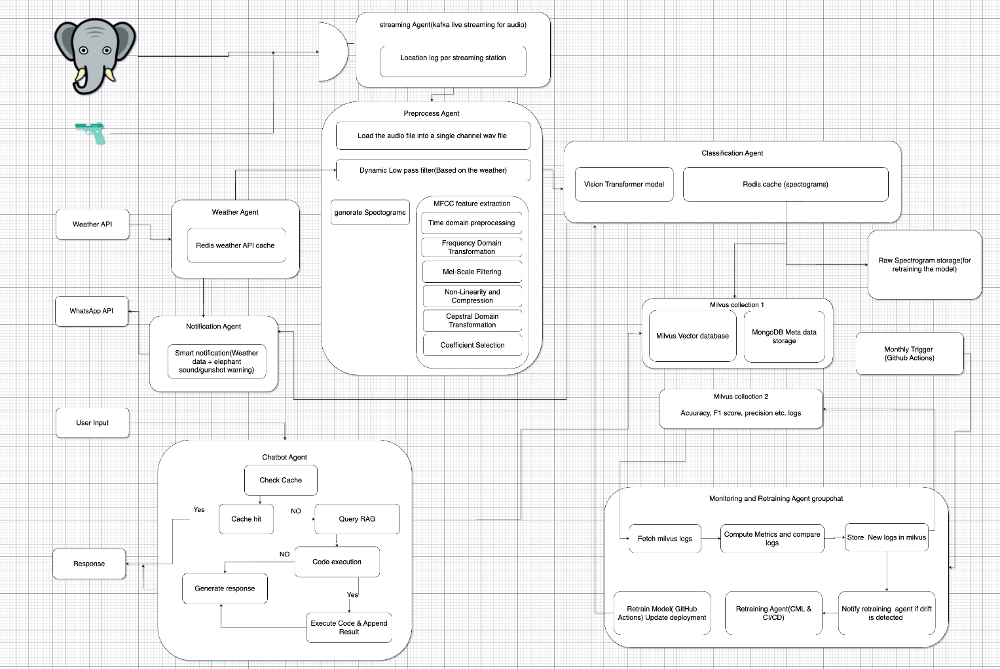

# EL-Sense: AI-Powered Elephant Monitoring & Early Warning System 🐘🌩️

🚧 **Status:** In Progress  
📍 **Location Focus:** Sri Lanka  
📅 **Proposal Year:** 2025  

## 📌 Overview
**EL-Sense** aims to reduce human-elephant conflict in Sri Lanka by providing a **real-time sound-based monitoring and early warning system**. Leveraging AI, spectrogram analysis, and agentic automation, the system detects **elephant rumbles**, **gunshots**, and environmental interference (like rain/thunder) to notify vulnerable communities and assist researchers with elephant behavior insights.

## 🎯 Objectives

- Detect approaching elephants and potential poaching activity
- Deliver timely alerts via WhatsApp/SMS
- Provide data for wildlife researchers and conservationists
- Enable long-term system monitoring and retraining via CI/CD pipelines

## 🧠 Core Technologies

### 🖼️ Audio Classification
- **Vision Transformer (ViT)** on Spectrograms
- **MFCC** for feature extraction
- **CNN** for MVP

### 🧩 AI Agent System
- **AutoGen**-based modular agents:
  - Classification Agent
  - Notification Agent
  - Weather Agent
  - Monitoring & Retraining Agent
  - Chatbot Agent (RAG + Milvus)

### 🧪 Data Processing
- Audio streamed via **Kafka** with location tagging
- Preprocessing: downsampling, denoising, MFCC + log-scale spectrogram generation
- Spectrograms stored in **MinIO/S3** for scalability

### 🗃️ Storage & Retrieval
- **Milvus** – vector DB for embeddings
- **MongoDB** – metadata (location, time, weather)
- **Redis** – spectrogram + weather caching

### 🔁 MLOps
- **GitHub Actions + CML** for CI/CD & monthly retraining
- Automated monitoring of model drift & performance

### 🌐 APIs & Deployment
- **FastAPI** – external communication
- **WeatherAPI** – contextual preprocessing
- **Twilio/WhatsApp API** – real-time alerts
- **Streamlit** – chatbot UI for querying detection data

## 🧪 Classification Logic

Spectrogram-based classification helps distinguish low-frequency rumbles and high-frequency trumpets from background noise (rain, insects, etc.). Using transfer learning with ViT improves performance despite limited data.

## 💬 Example Notification

> ⚠️ Elephant sound detected at **3:30 PM** in **Uduwara**.  
> ⚡ Thunder and rain detected in this area. This alert may be a **false positive**, please stay alert.

## 🔁 Planned Flow Diagram

1. Microphone → Kafka Stream  
2. Audio Preprocessing (MFCC + Spectrogram)  
3. Classification (ViT)  
4. Redis Cache → Milvus / MinIO  
5. Notification Agent → WhatsApp API  
6. Monthly Evaluation via GitHub Actions  
7. Chatbot Agent (RAG) for insights & queries  

## 🧠 Future Scope

- Integration with local forest department alert systems
- Offline model versions for edge deployment
- Mobile app for farmer-side alerts
- Expansion to detect other wildlife

---

### 📂 Project Status
- ✅ Proposal Document Complete  
- ✅ Initial Dataset Collection (~500 audio samples)  
- 🔁 In Progress: MVP with CNN  
- 🔁 In Progress: Preprocessing Pipeline & Kafka Stream

---

## 📜 License
This project is under the **MIT License**.

---

## 🤝 Contact
Built by **Tharushika**  
📧 [YourEmail@example.com]  
🌍 Based in Sri Lanka | Passionate about AI4Wildlife

